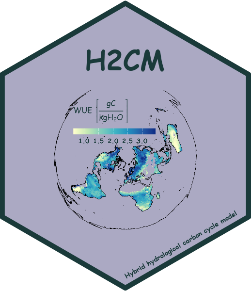

# H2CM 
**Hybrid modeling of global water–carbon cycles constrained by atmospheric and land observations**

A hybrid hydrological‑carbon cycle model (H2CM) that combines a physically‑based process model with deep learning to infer uncertain water‑ and carbon‑cycle parameters from observations while enforcing mass‑balance and other process constraints.

---

## 🚀 Features

- **Hybrid architecture**: Integrates a conceptual, process‑based layer (mass balance, hydrology, carbon fluxes) with deep neural networks to learn parameterizations from data.  
- **End‑to‑end learning**: Uncertain parameters are inferred by the neural networks, while the physics module ensures physically plausible outputs.  
- **Modular design**: Easily extend or swap components (new physics processes, datasets, neural architectures).

---

## 📂 Repository Structure

```text
├── datasets/              # PyTorch Dataset wrappers & data loading helpers
│   ├── ZarrDataset.py     # Manages training/validation/testing splits
│   ├── helpers_loading.py # Functions to load raw data into ZarrDataset
│   └── helpers_preproc.py # Preprocessing utilities for ZarrDataset
│
├── models/                # All model architectures & training scripts
│   ├── hybrid/            # High‑level hybrid model implementation
│   │   ├── cv_helpers.py      # k‑fold cross‑validation routines
│   │   ├── h2cm.py            # Core Hybrid H2CM model (PyTorch Lightning)
│   │   ├── common_step.py     # Shared training/validation/testing steps
│   │   ├── hybrid_helpers.py  # Forward‑pass helper functions
│   │   ├── train_model.py     # Training driver script using cross‑validation
│   │   └── 10_cv_slurm.sh     # Slurm batch script for 10‑fold CV
│   │
│   ├── neural_networks/   # Lower‑level NN component definitions
│   │   └── neural_networks.py
│   │
│   └── physics/           # Process‑based modules for water & carbon cycles
│       ├── water_cycle/   # Water‑cycle processes
│       │   ├── evapotranspiration.py
│       │   ├── gw_storage.py
│       │   ├── runoff.py
│       │   ├── snow.py
│       │   ├── soil_gw_recharge.py
│       │   ├── soil_moisture.py
│       │   ├── tws.py
│       │   └── water_cycle_forward.py
│       │
│       └── carbon_cycle/  # Carbon‑cycle processes
│           ├── gpp.py
│           ├── ter.py
│           ├── nee.py
│           └── carbon_cycle_forward.py
│
├── requirements.txt       # Python dependencies
├── README.md              # This file
└── LICENSE                # Project license (e.g., MIT)
```

## 🔄 Reproducibility

All required packages are listed in requirements.txt. Training datasets can be downloaded directly from their original sources (mentioned in the corresponding manuscript). A CUDA‑enabled GPU is required for efficient training and inference; CPU‑only runs may work but will be considerably slower.

## 🚀 Quick Start

The following assumes access to a Slurm cluster with GPU nodes. (If you don’t have Slurm, see the note at the end.)

```
# 1. Install Python dependencies
pip install -r requirements.txt

# 2. Set your custom paths
#    - In models/hybrid/train_model.py:
#        Replace "..." with:
#          - your Zarr dataset path (zarr_data_path)
#          - your desired model output directory (dir_trained_models)
#
#    - In models/hybrid/10_cv_slurm.sh:
#        Replace "..." in the log/output path and Python call
#        with your environment's actual paths

# 3. Launch training via Slurm (10-fold cross-validation)
sbatch models/hybrid/10_cv_slurm.sh
```

🖥️ Running Locally (without Slurm)?

If you don’t have access to Slurm, you can run training manually for each fold (note: this pathway hasn’t been extensively tested yet):

```
# Example: training fold 0
python models/hybrid/train_model.py 0
```

Need help? Reach out via the Contact section below.

## 🤝 Contributing

We warmly welcome contributions, suggestions, and ideas! Whether it’s:

* Bug reports & issues: Open an issue to let us know what’s not working or could be improved.

* Feature requests: Suggest new data sources, physics processes, or neural network architectures.

* Pull requests: Fork the repo, make changes on a branch, and submit a pull request.

* Collaboration: If you’re interested in joint research or community development, please get in touch!

Let’s build an open-source community around H2CM. Your feedback and collaboration will be what make this project thrive!

## 📬 Contact

* Issues & Pull Requests: https://github.com/zavud/h2cm/issues

* Email: zbaghirov@bgc-jena.mpg.de

Thank you for your interest in H2CM! We look forward to collaborating with you. 🌍💧🌱